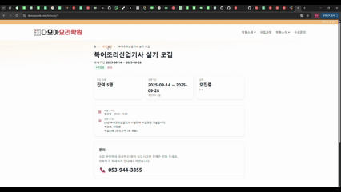
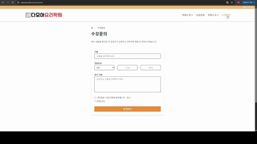
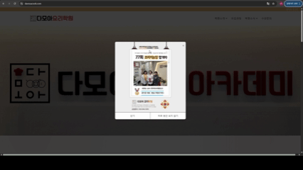

# 🍳 다모아요리학원 (Damoa Cook Academy)

<p align="center">
  <!-- 로고/커버: 원한다면 아래 경로에 이미지 추가 후 src 교체 -->
  
</p>

<p align="center">
  <a href="https://damoacook.com"></a>
  
  
  
  
  
  
  
  
  
  
</p>

<p align="center">
  <!-- 방문자 카운터: url 파라미터를 이 리포지토리 주소(인코딩)로 교체하세요 -->
  <a href="https://hits.seeyoufarm.com">
    &count_bg=%2379C83D&title_bg=%23555555&icon=&icon_color=%23E7E7E7&title=repo%20visits&edge_flat=false" alt="hits"/>
  </a>
</p>

- 학원 소개/강의 안내/공지·갤러리/수강문의 기능을 제공하는 **다모아요리학원 공식 웹사이트**입니다.  
- HRD-Net(공공데이터) 연동, 네이버 지도/스토리지, 문의 이메일 전송 등 **실서비스 운영 기능**을 갖췄습니다.

---

## 🔗 배포 & 접근

- **웹사이트**: https://damoacook.com  
- **관리자/테스트 계정**: 내부 운영용으로 비공개 (일반 사용자는 로그인 불필요)

---

## 📜 목차

- [프로젝트 소개](#-프로젝트-소개)
- [개발 환경](#-개발-환경)
- [채택 기술 & 브랜치 전략](#-채택-기술--브랜치-전략)
- [프로젝트 구조](#-프로젝트-구조)
- [역할 분담(개인 프로젝트)](#-역할-분담개인-프로젝트)
- [개발 기간 & 작업 관리](#-개발-기간--작업-관리)
- [신경 쓴 부분](#-신경-쓴-부분)
- [페이지별 기능](#-페이지별-기능)
- [트러블 슈팅](#-트러블-슈팅)
- [개선 목표 & 성능 최적화](#-개선-목표--성능-최적화)
- [설치 & 실행(요약)](#-설치--실행요약)
- [API 요약](#-api-요약)

---

## 📘 프로젝트 소개

- **서비스명**: 다모아요리학원 홈페이지  
- **목표**
  - 학원 브랜드와 커리큘럼을 명확히 전달
  - 수강생 유입을 위한 문의/상담 흐름 최적화
  - HRD-Net·Q-Net 등 **공공데이터/외부 연동**으로 최신 정보 제공
- **핵심 가치**
  - 콘텐츠 관리 효율(Django Admin)
  - 가벼운 프론트(React+Vite) / 빠른 배포(Vercel)
  - 확장 가능한 미디어 관리(S3 호환 스토리지)

---

## 🛠 개발 환경

- **Frontend**: React 18, Vite, Tailwind CSS, React Router, React Query  
- **Backend**: Django 5.x, Django REST Framework, SimpleJWT(관리자 인증)  
- **Infra**: Vercel(프론트), Render(백엔드), PostgreSQL, **Naver Object Storage(S3)**  
- **지도/메일**: Naver Maps JS v3, Naver SMTP  
- **버전/이슈관리**: GitHub, Projects, Issues

---

## ⚙ 채택 기술 & 브랜치 전략

### React + Vite + Tailwind
- 컴포넌트화로 **재사용성/유지보수성** 향상 (강의 카드, 배너, 문의 폼 등 공통화)
- Vite 기반 번들링으로 **개발 속도**와 **빌드 성능** 개선
- Tailwind 유틸리티 클래스 → **일관된 디자인 토큰** 운영

### Django + DRF
- RESTful API로 프론트/백 분리
- Django Admin으로 콘텐츠(강의/공지/갤러리/팝업) **운영 효율 극대화**

### 외부 연동
- **HRD-Net**: 강의 데이터/과정 안내
- **Naver SMTP**: 문의 접수 시 이메일 알림
- **Naver Maps**: 오시는 길/지점 안내
- **Naver Object Storage**: 미디어 업로드/호스팅

### 브랜치 전략 (개인 운영용 간소화 Git-flow)
- `main`: 배포용(릴리즈)
- `develop`: 통합 개발 브랜치
- `feat/<scope>`: 기능 단위 작업 → PR → `develop` 병합 후 삭제
- 필요 시 `hotfix/*`로 긴급 수정

---

## 🧱 프로젝트 구조
# Front
```
📦src
 ┣ 📂api
 ┃ ┣ 📜axios.js
 ┃ ┣ 📜gallery.js
 ┃ ┣ 📜home.js
 ┃ ┣ 📜hrdLectures.js
 ┃ ┣ 📜inquiry.js
 ┃ ┣ 📜lectures.js
 ┃ ┗ 📜news.js
 ┣ 📂assets
 ┃ ┗ 📜react.svg
 ┣ 📂components
 ┃ ┣ 📜Breadcrumbs.jsx
 ┃ ┣ 📜CommunityLayout.jsx
 ┃ ┣ 📜Footer.jsx
 ┃ ┣ 📜GallerySection.jsx
 ┃ ┣ 📜Header.jsx
 ┃ ┣ 📜ImagePicker.jsx
 ┃ ┣ 📜LectureCard.jsx
 ┃ ┣ 📜MainBannerSlider.jsx
 ┃ ┣ 📜MainLayout.jsx
 ┃ ┣ 📜MainMenuBoxes.jsx
 ┃ ┣ 📜MapWithPreview.jsx
 ┃ ┣ 📜MenuBox.jsx
 ┃ ┣ 📜NaverMap.jsx
 ┃ ┣ 📜NewsSection.jsx
 ┃ ┣ 📜PartnersSlider.jsx
 ┃ ┣ 📜PopupBanner.jsx
 ┃ ┗ 📜RecruitSection.jsx
 ┣ 📂contexts
 ┃ ┗ 📜AuthContext.jsx
 ┣ 📂data
 ┃ ┣ 📜certificates.js
 ┃ ┗ 📜partners.js
 ┣ 📂lib
 ┃ ┗ 📜naverMapLoader.js
 ┣ 📂pages
 ┃ ┣ 📂about
 ┃ ┃ ┣ 📜AboutLayout.jsx
 ┃ ┃ ┣ 📜FacilitiesPage.jsx
 ┃ ┃ ┣ 📜GreetingPage.jsx
 ┃ ┃ ┣ 📜HistoryPage.jsx
 ┃ ┃ ┣ 📜LocationSection.jsx
 ┃ ┃ ┣ 📜PartnersPage.jsx
 ┃ ┃ ┗ 📜VisionPage.jsx
 ┃ ┣ 📂certificates
 ┃ ┃ ┗ 📜CertificateDetailPage.jsx
 ┃ ┣ 📂community
 ┃ ┃ ┣ 📜GalleryDetailPage.jsx
 ┃ ┃ ┣ 📜GalleryEditorPage.jsx
 ┃ ┃ ┣ 📜GalleryPage.jsx
 ┃ ┃ ┣ 📜NewsDetailPage.jsx
 ┃ ┃ ┣ 📜NewsEditorPage.jsx
 ┃ ┃ ┗ 📜NewsPage.jsx
 ┃ ┣ 📂inquiries
 ┃ ┃ ┗ 📜InquiryPage.jsx
 ┃ ┣ 📂login
 ┃ ┃ ┗ 📜LoginPage.jsx
 ┃ ┣ 📂popup
 ┃ ┃ ┣ 📜PopupManageForm.jsx
 ┃ ┃ ┗ 📜PopupManageList.jsx
 ┃ ┣ 📜Contact.jsx
 ┃ ┣ 📜Home.jsx
 ┃ ┣ 📜HrdLectureDetailPage.jsx
 ┃ ┣ 📜LectureDetailPage.jsx
 ┃ ┣ 📜LectureEditorPage.jsx
 ┃ ┣ 📜LecturesPage.jsx
 ┃ ┗ 📜LegalPrivacy.jsx
 ┣ 📂routes
 ┃ ┗ 📜RequireAuth.jsx
 ┣ 📂sections
 ┃ ┣ 📜ContactMapCta.jsx
 ┃ ┣ 📜FacilityShowcaseHome.jsx
 ┃ ┣ 📜InquiryCtaSection.jsx
 ┃ ┣ 📜PartnersSection.jsx
 ┃ ┗ 📜TrustStrip.jsx
 ┣ 📜App.css
 ┣ 📜App.jsx
 ┣ 📜index.css
 ┗ 📜main.jsx
```
# Back
```
📦apps
 ┣ 📂about
 ┃ ┣ 📜admin.py
 ┃ ┣ 📜apps.py
 ┃ ┣ 📜models.py
 ┃ ┣ 📜serializers.py
 ┃ ┣ 📜tests.py
 ┃ ┣ 📜urls.py
 ┃ ┗ 📜views.py
 ┣ 📂accounts
 ┃ ┣ 📜admin.py
 ┃ ┣ 📜apps.py
 ┃ ┣ 📜models.py
 ┃ ┣ 📜permissions.py
 ┃ ┣ 📜serializers.py
 ┃ ┣ 📜tests.py
 ┃ ┣ 📜urls.py
 ┃ ┣ 📜views.py
 ┣ 📂certificates
 ┃ ┣ 📜admin.py
 ┃ ┣ 📜apps.py
 ┃ ┣ 📜models.py
 ┃ ┣ 📜serializers.py
 ┃ ┣ 📜tests.py
 ┃ ┣ 📜urls.py
 ┃ ┗ 📜views.py
 ┣ 📂gallery
 ┃ ┣ 📜admin.py
 ┃ ┣ 📜apps.py
 ┃ ┣ 📜models.py
 ┃ ┣ 📜serializers.py
 ┃ ┣ 📜tests.py
 ┃ ┣ 📜urls.py
 ┃ ┗ 📜views.py
 ┣ 📂inquiries
 ┃ ┣ 📜admin.py
 ┃ ┣ 📜apps.py
 ┃ ┣ 📜models.py
 ┃ ┣ 📜serializers.py
 ┃ ┣ 📜tests.py
 ┃ ┣ 📜urls.py
 ┃ ┣ 📜views.py
 ┣ 📂lectures
 ┃ ┣ 📜admin.py
 ┃ ┣ 📜apps.py
 ┃ ┣ 📜models.py
 ┃ ┣ 📜serializers.py
 ┃ ┣ 📜tests.py
 ┃ ┣ 📜urls.py
 ┃ ┣ 📜views.py
 ┃ ┣ 📜views_combined.py
 ┃ ┗ 📜views_hrd.py
 ┣ 📂news
 ┃ ┣ 📜admin.py
 ┃ ┣ 📜apps.py
 ┃ ┣ 📜models.py
 ┃ ┣ 📜serializers.py
 ┃ ┣ 📜tests.py
 ┃ ┣ 📜urls.py
 ┃ ┗ 📜views.py
 ┣ 📂popup
 ┃ ┣ 📜admin.py
 ┃ ┣ 📜apps.py
 ┃ ┣ 📜models.py
 ┃ ┣ 📜serializers.py
 ┃ ┣ 📜tests.py
 ┃ ┣ 📜urls.py
 ┃ ┗  📜views.py
 ┗ 📜__init__.py


📦config
 ┣ 📂__pycache__
 ┃ ┣ 📜settings.cpython-312.pyc
 ┃ ┣ 📜urls.cpython-312.pyc
 ┃ ┣ 📜wsgi.cpython-312.pyc
 ┃ ┗ 📜__init__.cpython-312.pyc
 ┣ 📜asgi.py
 ┣ 📜settings.py
 ┣ 📜urls.py
 ┗ 📜wsgi.py
```

## 👤 역할(개인 프로젝트)

- **기획 · 디자인 · 프론트엔드 · 백엔드 · 배포 · 모니터링** 전 과정 **단독 수행**
- 주요 공수
  - 정보구조(IA) & 화면흐름 설계, OG/Kakao 미리보기, 접근성 고려
  - 강의/공지/갤러리/팝업 도메인 모델링 & Admin 구성
  - 수강문의 API/이메일 연동(실패 로깅·재발송 플로우)
  - CORS/CSRF/보안 헤더 설정, 스토리지/정적파일 파이프라인

---

## 🗓 개발 기간

- **전체**: 2025-07 ~ 2025-09  

---

## ✨ 신경 쓴 부분

- **문의 전송 안정성**: DB 저장 후 메일 발송 실패 시 로깅, 재발송 관리 훅
- **성능**: 이미지 최적화(WebP/치수 명시), 캐시 헤더, Vercel 에지 캐시
- **운영 UX**: 팝업 배너(오늘 하루 보지 않기), 반응형 레이아웃, HRD-Net 공공데이터 연결
- **보안**: 비밀키/토큰 환경변수 운영, 도메인 기반 CORS/CSRF 화이트리스트

---

## 📱 페이지별 기능

### 홈 (Home)
- 모집중 강의 슬라이드, 공지/갤러리 하이라이트
- 

### 학원소개 (abouut)
- 학원 인사말, 연혁, 비전, 협력업체, 오시는길 안내
- 

### 강의 (Lectures)
- 내부 강의 목록/상세, **HRD-Net 연동 강의** 정보 제공
- 

### 공지/갤러리 (News/Gallery)
- 목록/상세, 이미지 S3 저장/서빙
- 

### 수강문의 (Inquiry)
- 무로그인 폼 제출 → **이메일 알림**
- 

### 오시는 길 (Map)
- **Naver Maps JS v3**로 위치 안내
- 

### 팝업배너 (Popup)
- **Naver Maps JS v3**로 위치 안내
- 

---

## 🧩 트러블 슈팅

### 1) SMTP 메일 미수신 이슈
- **현상**: 201(Created) 응답이나 메일 미수신
- **원인**: `EMAIL_USE_TLS` 공백/따옴표 문제, DMARC/From 미스매치
- **해결**: `fail_silently=False` 로깅, 발신 도메인/포트/TLS 점검, From/Reply-To 분리

### 2) CORS/CSRF 프리뷰 도메인
- **현상**: Vercel 프리뷰에서 CORS/CSRF 차단
- **해결**: `CORS_ALLOWED_ORIGIN_REGEXES`에 `^https://.*\.vercel\.app$` 추가, CSRF Trusted Origins 반영

---

## 🚀 개선 목표 & 성능 최적화

### Lighthouse
- Best Practices/SEO 90~100 유지
- CLS/LCP 개선을 위한 이미지 치수/지연로딩/캐시 정책 강화

### 이미지/정적 자원
- WebP/AVIF 변환(가능 시), 썸네일 제작
- WhiteNoise 해시 서빙 + CDN 캐시

### 데이터/운영
- 관리자 전용 프론트(운영 대시보드)
- HRD-Net 데이터 동기화 자동화 & 백업

---

## 🧪 설치 & 실행(요약)

> 실제 비밀값은 인프라 환경변수로 주입합니다(README에 값 공개 없음).

### Frontend (로컬)
```bash
cd frontend
npm i
npm run dev  # http://localhost:5173
Backend (로컬)
bash


cd backend
# Poetry 또는 pip 중 택1
poetry install && poetry run python manage.py migrate && poetry run python manage.py runserver 0.0.0.0:8000
# 또는
python -m venv .venv && source .venv/bin/activate
pip install -r requirements.txt
python manage.py migrate && python manage.py runserver 0.0.0.0:8000
```
## 🔎 API 요약
GET /api/lectures/ — 내부 강의 목록

GET /api/lectures/{id}/ — 내부 강의 상세

GET /api/hrd-lectures/ — HRD-Net 연동 강의 목록

GET /api/hrd-lectures/{id}/ — HRD-Net 연동 강의 상세

POST /api/inquiries/ — 수강문의 접수(메일 알림)

GET /api/news/, GET /api/gallery/ — 콘텐츠 목록/상세
